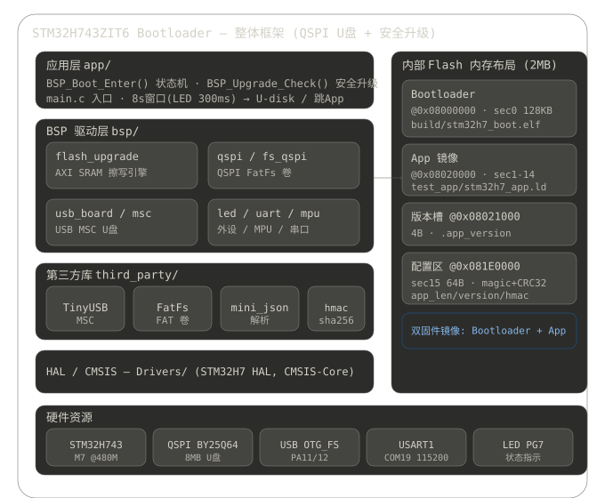

# STM32H743ZIT6 Bootloader — QSPI 虚拟 U 盘 + 安全升级

## 0. 整体框架图



## 1. 项目概述

基于 **LXB743ZI-P1 开发板**（STM32H743ZIT6，Cortex-M7 @480MHz）的 Bootloader，把板载 **8 MB QSPI Flash（W25Q64 兼容）虚拟成 USB Mass Storage（U 盘）**，并支持**安全固件升级**：

| 能力 | 说明 |
|------|------|
| 虚拟 U 盘 | TinyUSB MSC 后端把 QSPI FatFs 卷暴露为 PC 上的 U 盘，可直接拷文件 |
| 安全升级 | `verify.json`（名称/长度/HMAC-SHA256/版本）+ 同名 `.bin` 落到 U 盘 → 复位后 Bootloader 校验 → 擦写 App → 更新配置 → 跳转 |
| 安全校验 | HMAC-SHA256（共享密钥，自研 RFC2104 实现） + 版本比对 + 向量表/栈顶合法性 + 配置区 CRC32 |
| 防砖 | 任何校验失败 **绝不擦写** 已运行的 App；升级包校验通过才动 Flash |

> 升级包必须经由 **U 盘（OTG_FS USB）** 拷入 —— 这是设计上的验收路径，也是本机（沙箱）无法用 openocd 直写 QSPI 时的标准验证方式（见第 8 节）。

---

## 2. 硬件资源

| 资源 | 配置 |
|------|------|
| MCU | STM32H743ZIT6（Cortex-M7，480 MHz） |
| QSPI Flash | 板载 JEDEC `68 40 17` → **Boya BY25Q64**（Winbond W25Q64 命令兼容 clones，8 MB / 64 Mbit） |
| QSPI CLK  | PF10 (AF9) |
| QSPI NCS  | PG6  (AF10) |
| QSPI IO0  | PF8  (AF10) |
| QSPI IO1  | PF9  (AF10) |
| QSPI IO2  | PF7  (AF9) |
| QSPI IO3  | PF6  (AF9) |
| USB（U 盘）| OTG_FS，PA11/PA12（**接用户机器**，非本沙箱） |
| 调试串口 | USART1，PA9(TX)/PA10(RX) → ST-Link VCP（**本机 COM19**，115200 8N1） |
| 状态 LED  | PG7，低电平点亮；Bootloader 200 ms 快闪 / 跳转前 8 s 窗口 300 ms 闪烁 / App 1 s 慢闪 |
| HSE | 25 MHz 无源晶振 |
| 烧录/调试 | ST-Link V2（SWD） |

---

## 2.1 日志接口（bsp/bsp_log.c）

应用代码统一用 `PRINT_LOG(fmt, ...)` 输出，**不要**直接调 `BSP_UART_*`。

| 特性 | 说明 |
|------|------|
| 非阻塞 | 格式化进 256 B 栈缓冲 → 压入 1 KB TX 环形缓冲 → 立即返回；TXE 中断在后台逐字节排空 |
| 编译期开关 | `bsp_log.h` 的 `PRINT_LOG_ENABLE` 置 0 时 `PRINT_LOG(...)` 展开为 `((void)0)`，日志全部消失、零运行时开销 |
| ISR 归属 | `bsp_log.c` 独占 USART1 句柄；**不得**在别处再声明 USART1 的 `UART_HandleTypeDef` |
| 中断接线 | `USART1_IRQHandler()` → `log_uart_tx_irq()` 必须存在于两个 `stm32h7xx_it.c`。缺了它环形缓冲填满后日志**静默停止**（不报错） |
| RAM 镜像 | `printf_log()` 顺带把每个字节追加到 `bsp/uart.c` 的 `g_uart_log`（16 KB），供 `capture.py` 走 SWD dump 取回完整启动日志 |

`bsp/uart.c/h` 已退化为兼容层：保留 `BSP_UART_Init()`（转调 `bsp_log_init()`）、`BSP_UART_SendStr/SendBuf` 和 `g_uart_log` 镜像。

---

## 3. Flash 内存布局（2 MB 内部 Flash，双 Bank）

| 区域 | 地址 | 说明 |
|------|------|------|
| Bootloader | `0x08000000` 扇区 0（128 KB） | 本工程 `build/stm32h7_boot.elf` |
| App 镜像   | `0x08020000` 扇区 1–14 | 链接脚本 `test_app/stm32h7_app.ld` |
| 版本槽     | `0x08021000`（`App.bin` 偏移 `0x1000`，4 B） | `test_app/app/app_version.c` 固定段 `.app_version` |
| 系统配置区 | `0x081E0000` 扇区 15（64 B） | `app_config_t`：magic / app_len / version[4] / app_hmac[32] / status / crc32 |

`app_config_t`（共 64 B）：`+0 magic(0xB0075EED)` / `+4 app_len` / `+8 version[4]` / `+12 app_hmac[32]` / `+44 status` / `+48 crc32`（CRC 覆盖 `[0,48)`）/ `+52 reserved[12]`。
CRC 由 `BFLASH_ConfigCrc()` 计算：**覆盖除 crc32 自身外的全部字段**（曾因把 crc 字段也算进 CRC 导致配置永远校验失败，已修复）。

---

## 4. 构建与烧录

### 4.1 Bootloader

```bash
cmake -B build -G Ninja -DCMAKE_BUILD_TYPE=Debug
cmake --build build                 # Debug，产物 build/stm32h7_boot.{elf,bin}
cmake --build build --config Release
```

- 零警告目标。体积：Debug `text 110,768 B / data 2,268 B / bss 39,856 B`（≈110 KB / 128 KB，84%）；Release `text 72,264 B / data 2,244 B / bss 39,848 B`（bin ≈74 KB）。
- 升级擦写引擎（Flash 编程/校验）放在 **AXI SRAM（0x24000000）** 执行，规避 H7 Bank 内擦写取指停顿。⚠️ **绝不可放 DTCM（0x20000000）**——Cortex-M7 的 I-Code 总线无法从 DTCM 取指，引擎放 DTCM 会立即 BusFault→`Default_Handler`（已踩坑修复）。

### 4.2 Keil MDK-ARM 构建（第二工具链）

同一份源码同时支持 GCC/CMake 与 Keil/ARMCLANG 两条链路，工程在 `MDK-ARM/`：

- **工程文件**：`MDK-ARM/stm32h743.uvprojx`（单 Target `stm32h743`，ARMCLANG V6.14，`Keil.STM32H7xx_DFP.4.1.3`）
- **分散加载**：`MDK-ARM/stm32h743.sct`（逐段对齐 `sys_startup/stm32h743xix_flash.ld`）
- **命令行为**（无需打开 IDE）：

```bash
"/c/Keil_v5/UV4/UV4.exe" -b -j0 -t stm32h743 \
  -x "MDK-ARM/stm32h743.uvprojx" -o "MDK-ARM/build_log.htm"
# 期望：build_log.htm 末尾 "0 Error(s), 0 Warning(s)"
# 产物：MDK-ARM/Objects/stm32h7_boot.{axf,hex,bin}
```

体积（Release 等价，`Optim=6`）：`Code 49,844 / RO-data 4,460 / RW-data 64 / ZI-data 39,152`，bin ≈120 KB。

**四条移植约束**（与 CMake 侧的差异，改工程前务必先读）：

| # | 约束 | 原因 |
|---|---|---|
| 1 | **不编译 `bsp/syscalls.c`**；必须保留 `MDK-ARM/mdk_target.c` | 前者是 GCC 的 newlib stub（含 POSIX `<sys/stat.h>`），与 ARMCLANG 的 retarget 层冲突；后者提供 `__use_no_semihosting`。删掉后者能编译能链接，但运行时会撞 semihosting `BKPT` |
| 2 | HAL **按外设逐个列出**（当前 15 个 `.c`），不要整目录 glob | Keil 会整份链接列出的 `.c`（没有 `--gc-sections` 兜底），glob 会拖进 ~110 个无关注册器 |
| 3 | `IncludePath` 需含 `..\Drivers\CMSIS\Include` 与四个 `..\third_party\*` 目录，且**去掉** `Core\Inc` / `middleware` / CMSIS DSP+NN | 那份路径来自别的工程 |
| 4 | `Define` = `STM32H743xx,USE_HAL_DRIVER,CORE_CM7,CFG_TUSB_MCU=OPT_MCU_STM32H7,CFG_TUSB_OS=OPT_OS_NONE,BOARD_TUD_RHPORT=0` | TinyUSB 的 MCU/OS 选择必须与 CMake 侧一致 |

**`.upgrade_ram` 的 load/run 分离（两工具链写法不同，是本工程最容易踩的地方）**：

- GCC：`.upgrade_ram : { ... } >SRAM1 AT> FLASH` + `_supgrade_ram_load = LOADADDR(.upgrade_ram)`。
- Keil：分散加载**不能导出任意符号别名**，且 armlink **不接受** `UPGRADE_RAM_LOAD LR_IROM1 { ... }` 这种嵌套 load region（实测报 `L6630E`/`L6226E`）。因此改为**独立顶层 load region**，并以**固定 Flash 地址**定位：

```
LR_IROM1   0x08000000 0x0001E000   ; 代码/RO/数据初值 + DTCM 的 STACK/HEAP
LR_UPGRADE 0x0801E000 0x00002000   ; 引擎：load 在 Flash，run 在 AXI SRAM
  UPGRADE_RAM 0x24000000 0x00002000
```

`bsp/flash_upgrade.c` 里用 `#if defined(__ARMCC_VERSION)` 取 `Image$$UPGRADE_RAM$$Base/$$Limit` 与 `Load$$UPGRADE_RAM$$Base`。⚠️ **执行区名必须叫 `UPGRADE_RAM`**——armlink 生成的符号名取自执行区名，写成 `ER_UPGRADE` 就会链接报 `L6218E: Undefined symbol Image$$UPGRADE_RAM$$Base`。

> 因为存在两个非连续 load region，`fromelf` 必须用 **`--bincombined`** 才能得到单个可烧写镜像；用 `--bin` 会输出一个**目录**（每个 region 一个文件）。

**其他已对齐项**：`sys_startup/arm/startup_stm32h743xx.s` 的 `Stack_Size=0x400` / `Heap_Size=0x200`（与 `.ld` 的 `_Min_Stack_Size`/`_Min_Heap_Size` 一致，原来误写成 8 KB / 0）；`v6Lang=5` / `v6LangP=5`（C99/C11）；`uThumb=1` + `<thumb>1</thumb>`；`<Misc>` 里的告警选项**用单横线**（ARMCLANG 不支持 `--Wno-xxx`）。

### 4.3 Test App（升级目标 / 跳转目标）

```bash
cd test_app && cmake -B build -G Ninja -DCMAKE_BUILD_TYPE=Release && cmake --build build
# 产物 test_app/build/stm32h7_app.{elf,bin}（版本槽由 app_version.c 决定）
```

### 4.4 直烧 App + 配置（用于跳转验证 Test B）

```bash
python tools/flash_app_direct.py test_app/build/stm32h7_app.bin
```
该脚本把 App 烧入 `0x08020000`、在 `0x08021000` 写版本槽、在 `0x081E0000` 写系统配置（magic/len/version/HMAC/CRC），使 Bootloader 校验通过并跳转。

---

## 5. Boot 决策状态机（app/boot.c）

```
上电 → BSP_Boot_Enter()
  ├─ 1. 读系统配置 (0x081E0000) + CRC32 校验
  ├─ 2. 校验 App：app_len∈[512,APP_SIZE] / 版本分量 0..99 / 向量表合法(SP 在 RAM 且 8B 对齐, reset 向量在 App 内)
  │        / 版本槽(0x08021000)==配置版本 / HMAC-SHA256(整段 App)==配置 app_hmac
  ├─ 3a. 全部 OK → 启动 USB，进入 8 s 倒计时窗口（LED 快闪, tud_task）
  │        ├─ 窗口内 USB 连接  → U-disk 模式（不跳转；拔插不恢复倒计时，下次复位重判）
  │        └─ 窗口超时(USB 未连) → HAL_DeInit / 关中断 / 关 MPU / 关 I/D-Cache / 设 MSP / VTOR / 跳 App
  └─ 3b. 任一失败 → U-disk 模式（拷包后复位重试）
```

---

## 6. 安全升级流程（app/upgrade.c → BSP_Upgrade_Check）

`BSP_Upgrade_Check()` 在 `main.c` 中于 USB/跳转逻辑**之前**调用，故升级检测与 USB 是否连接无关：

1. `FS_Mount()`（空盘自动 FAT 格式化）
2. 打开 `verify.json`，解析 `name / len / HMAC-SHA256 / version`
3. 打开同名 `.bin`，比对 `f_size == len`
4. 流式 HMAC-SHA256（共享密钥）比对 JSON 中的值
5. 读当前 App 版本（0x08021000）；**版本相同则跳过（保留包）**，不同（含降级）则继续
6. 两阶段擦除 App：`BFLASH_EraseApp(len)` 仅按实际长度擦非末块，留末块到编程前由 `BFLASH_EraseAppLastSector(len)` 即时擦除（避免整片先擦 + 中途掉电风险）。
7. 流式编程 + 读回校验（`BFLASH_ProgramBlock` / `VerifyBlock`，AXI SRAM 引擎）。编程走**经验证 HAL `HAL_FLASH_Program(FLASH_TYPEPROGRAM_FLASHWORD)` 通路**，每次操作前清双 Bank 错误标志（`FLASH_FLAG_ALL_ERRORS_BANK1/2`）。
8. 写系统配置区（magic/len/version/hmac/status/crc）
9. 卸载；随后 Bootloader 进入 8 s 窗口，USB 未连则跳转新 App

**任何校验失败都在擦写之前 abort**，已运行 App 不会被破坏。

---

## 7. 工具链（tools/）

| 脚本 | 作用 |
|------|------|
| `gen_upgrade.py` | 由 App `.bin` 生成升级包：`verify.json`（name/len/HMAC/version）+ 同名 `.bin`；读取 `0x1000` 版本槽，HMAC 用 `boot_secret.py` 共享密钥 |
| `verify_serial.py` | 抓 COM19 串口做验收：`--expect jump|udisk|upgrade`，输出 PASS/FAIL 计数 |
| `verify_hmac.py` | 交叉校验：`.bin` 版本槽 == `verify.json` 版本；工具密钥 == Bootloader `BOOT_HMAC_KEY` |
| `flash_app_direct.py` | 直烧 App + 版本槽 + 配置区（路径统一用正斜杠，规避 TCL 反斜杠转义；显式声明 bank2 供 openocd 写 `0x081E0000`） |
| `boot_secret.py` | 单一密钥源：`b"STM32H7BootKey2026#U-Disk"`（25 B），与 `bsp/flash_secure.h` 完全一致 |

> 版本组件取值范围 0..99；HMAC 为 RFC2104 标准实现（密钥不足 64 B 时零填充），主机签名与固件验签字节级一致。

---

## 8. 验证状态与 Test A 流程

### 8.1 已验证（真机，openocd + gdb + 串口）

- **跳转验证（Golden path）**：直烧 App+配置后复位 → Bootloader 启动 → QSPI 挂载 → 配置 CRC/向量/HMAC/版本全过 → `[BOOT] app image OK app vX.Y.Z` → 8 s 窗口；USB 连接则 U-disk 模式（符合设计），未连则跳转 App。v1.0.0.5 / v1.0.0.6 均验证通过。
- **升级包交叉校验**：`verify_hmac.py` 通过 —— 工具密钥 == `BOOT_HMAC_KEY`（25 B），版本槽 == `verify.json` 版本（1.0.0.6）。
- **`BFLASH_ProgramBlock` 真机验证（openocd + gdb 直调）**：hw-bp 命中 `BFLASH_Relocate`→`finish` 完成引擎 relocate 到 AXI SRAM；`flash_erase_sector` + `BFLASH_ProgramBlock(0x08040000, buf, 32)` → 均返回 0，回读 8 字与写入 pattern 完全一致，5.0 s 干净返回不卡死。
- **端到端 U 盘升级 v1.0.0.6（真机通过）**：串口实测 boot banner 含 `[BOOT] relocating flash engine to AXI SRAM...`；Bootloader 检测升级包 → 执行 `BFLASH_EraseApp`+`BFLASH_ProgramBlock` → 重启 → 打印 `STM32H743 TEST APP v1.0.0.6`。Flash 读回确认：版本槽 `0x08021000=0x06000001`（v1.0.0.6）、App 向量合法、config 扇区 `magic=0xB0075EED`+CRC 完好、Bootloader 向量完好。
- **升级代码已接线**：`BSP_Upgrade_Check()` 在 `app/main.c` 中于 USB/跳转逻辑之前调用。

### 8.2 升级包（Test A 已完成验证）

升级包位于 `test_app/dist/`：
- `test_app/dist/stm32h7_test.bin`（46,164 B，版本槽 `[1,0,0,6]`，App banner 动态打印版本槽）
- `test_app/dist/verify.json`（`name=stm32h7_test.bin`、`len=46164`、`HMAC-SHA256`、`version=1.0.0.6`）
- `test_app/dist/stm32h7_boot.bin`（Bootloader 镜像，需升级 Bootloader 时烧录内部 Flash sector0）

**本沙箱局限**：openocd 的 `stmqspi` 驱动在本环境无法拉起 H743 QSPI，且无 `mkfs.fat`/`mtools`，故无法用 openocd 直写 QSPI 注入升级包；升级走设计的 U 盘路径（用户机器拷包 / 沙箱看 COM19）。

**用户操作步骤：**
1. 将 `stm32h7_test.bin`（**文件名必须保持 `stm32h7_test.bin`**）与 `verify.json` 拷到 U 盘根目录。
2. 安全弹出，复位板子（或断电再上电）。**升级本身与 USB 是否连接无关**（检测发生在 USB 窗口之前）；若想看到新 App 真正运行，请在复位时**拔掉 OTG_FS USB**，使 8 s 窗口超时后跳转。
3. 验收：
   ```bash
   python tools/verify_serial.py --port COM19 --expect upgrade   # 期望 HMAC-SHA256 verified OK + upgrade SUCCESS
   python tools/verify_serial.py --port COM19 --expect jump      # 期望 app image OK v1.0.0.6 + TEST APP v1.0.0.6 + app alive @1Hz
   ```

---

## 9. 关键源码索引

- Boot 状态机：`app/boot.c :: BSP_Boot_Enter()` / `jump_to_app()` / `app_hmac_check()`
- 升级流程：`app/upgrade.c :: BSP_Upgrade_Check()`（HMAC/版本/擦写/配置更新）
- Flash 引擎：`bsp/flash_upgrade.c/.h`（`BFLASH_EraseApp` / `BFLASH_EraseAppLastSector` / `ProgramBlock` / `VerifyBlock` / `ConfigRead`/`ConfigWrite` / `ConfigCrc` / `AppVersionRead`），底层走 HAL `HAL_FLASHEx_Erase` / `HAL_FLASH_Program(FLASH_TYPEPROGRAM_FLASHWORD)`
- QSPI 驱动：`bsp/qspi.c/.h`（W25Q64 兼容，HAL 间接 + 映射 + QE）
- 日志：`bsp/bsp_log.c/.h`（`PRINT_LOG` / `printf_log` / `vprintf_log` / `log_uart_tx_irq` / `bsp_log_init`，非阻塞 TX 环形缓冲 + TXE 中断）；`bsp/uart.c/.h` 为兼容层与 RAM 镜像 `g_uart_log`；中断接线在两个 `app/stm32h7xx_it.c`
- 安全：`bsp/flash_secure.h`（`BOOT_HMAC_KEY`）、`third_party/hmac_sha256/`（RFC2104）
- USB U 盘：`bsp/usb_board.c` / `bsp/msc_qspi.c` / `bsp/tusb_config.h`
- Test App：`test_app/app/main.c`（1 Hz 心跳 + 动态版本 banner）、`test_app/app/app_version.c`、`test_app/CMakeLists.txt`（Release，复用 Bootloader 的 `bsp_log.c`/`uart.c`/`syscalls.c`/`led.c`）
- 链接脚本：`stm32h743xix_flash.ld`（Bootloader）、`test_app/stm32h7_app.ld`（App @0x08020000，版本槽 @0x08021000）
