# Mcu_Project_Design_By_Agent

在AI Agent快速发展的当下，前端和桌面端程序已经可以大幅度被AI取代，嵌入式看起来有壁垒，其实作为固定的知识，也已经没有壁垒，使用AI Agent进行单片机开发其实也成为了现实。

对于AI来说，生成代码不困难，不过单片机交叉编译的特性也有其难点，需要解决如下问题。

❓ **如何让AI自动编译、调试、下载和仿真，然后走通自我迭代流程**  
❓ **提示词如何实现，才能让AI更好的规划单片机任务处理**  
❓ **AI完成的项目，如何进行验收测试，遇到问题如何解决**  

带着这些疑问，我使用了不算太强的Vibe Coding产品，完成本系列的项目。

⚠️注意：**项目中使用的Drivers和third_party目录为重复且占用空间较大，因此打包保存为support_tools/env_support_for_stm32h743.zip/env_support_for_stm32f429.zip中，解压后放在具体工程项目中即可使用**  

⚠️注意：**RTOS环境zephyr的支持占用也十分巨大，已经打包为support_tools/env_support_for_zephyr.zip，解压后放在具体工程项目中即可使用**  

⚠️注意：**项目中使用SD卡需要包含一些文件，需要从support_tools/sd_card目录下拷贝**  

## 项目说明

在项目说明前，这里提供我验证过的单片机支持ai agent的环境。

- [单片机支持ai agent开发环境](./document/support.md)  

本系列下项目如下所示。

✅ 001.基于tinyusb实现USB混合设备(CDC+MSC)  
✅ 002.基于tinyusb实现UVC摄像头(基于ov5640)  
✅ 003.使用lvgl实现oled显示(支持通过sd卡使用中文字库)  
✅ 004.基于SD卡和OLED实现图片轮播功能  
✅ 005.实现基于CMSIS-NN的人存在检测功能(ov5640+CMSIS-NN+人检测)  
✅ 006.实现基于CMSIS-NN的人脸检测和显示的功能(ov5640+CMSIS-NN+人脸模型)  
✅ 007.基于tinyusb实现CMSIS-DAP协议的调试器  
✅ 008.基于lvgl实现有菜单的综合应用(时钟、相机、nes模拟器、图片查看、文本阅读器)  
✅ 009.基于zephyr系统实现lvgl显示功能  
✅ 101.基于lwip实现局域网管理系统(http/https/uart-shell/telnet-shell/snmp)  

### 具体项目效果和提示词说明

#### 基于tinyusb实现USB混合设备(CDC+MSC)

🚀 [001.基于tinyusb实现USB混合设备(CDC+MSC)](./001.stm32h743_tinyusb_cdc_msc/README.md)

提示词内容：[项目提示词](./001.stm32h743_tinyusb_cdc_msc/prompter.md)  

**AI开发**：项目框架、tinyusb移植、复合设备 - 95%  
**个人参与**: 仿真环境、提示词 - 5%  

工作量：

1. 实现USB底层驱动
2. 移植tinyusb库，实现CDC、MSC应用
3. 实现混合设备，完善相关接口

#### 基于tinyusb实现UVC摄像头(ov5640)

🚀 [002.基于tinyusb实现UVC摄像头(ov5640)](./002.stm32h743_tinyusb_uvc_ov5640/README.md)

提示词内容：[项目提示词](./002.stm32h743_tinyusb_uvc_ov5640/prompter.md)

**AI开发**：项目框架、tinyusb移植、UVC驱动实现 - 70%  
**个人参与**: 仿真环境、提示词、OV5640驱动 - 30%  

工作量：

1. 集成ov5640驱动
2. 移植tinyusb库，实现UVC应用
3. 摄像头采集实现多缓冲机制，通过usb接口提交

#### 使用lvgl实现oled显示(支持通过sd卡使用中文字库)

🚀 [003.使用lvgl实现oled显示(支持通过sd卡使用中文字库)](./003.stm32h743_lvgl_oled/README.md)

提示词内容：[项目提示词](./003.stm32h743_lvgl_oled/prompter.md)

**AI开发**：项目框架、lvgl移植、sd卡/fatfs移植 - 90%  
**个人参与**: 仿真环境、提示词、OLED驱动 - 10%  

工作量：

1. 实现sd卡驱动、fatfs移植、中文字库支持
2. 移植lvgl，实现和sd卡字库联动
3. 实现lvgl界面，包含中文显示

#### 基于SD卡和OLED实现图片轮播功能

🚀 [004.基于SD卡和OLED实现图片轮播功能](./004.stm32h743_sd_oled_img/README.md)

提示词内容：[项目提示词](./004.stm32h743_sd_oled_img/prompter.md)

**AI开发**：项目框架、sd卡/fatfs移植、图片解析库支持 - 90%  
**个人参与**: 仿真环境、提示词、OLED驱动 - 10%

工作量：

1. 实现sd卡驱动、fatfs移植、图片读取
2. 移植jpg解析库，获得图像数据
3. 将图像数据显示到界面上

#### 基于CMSIS-NN的人存在检测功能(ov5640+CMSIS-NN+人检测)

🚀 [005.基于CMSIS-NN的人存在检测功能(ov5640+CMSIS-NN+人检测)](./005.stm32h743_person_detect/README.md)

提示词内容：[项目提示词](./005.stm32h743_person_detect/prompter.md)

**AI开发**：项目框架、CMSIS-NN移植，人检测模型、输出显示 - 95%  
**个人参与**: 仿真环境、提示词、OV5640驱动、OLED驱动 - 5%

工作量：

1. 集成ov5640驱动、oled驱动
2. 移植CMSIS-NN框架支持，并获取人检测模型
3. 多缓冲图像采集，经过模型框架处理，将整合数据输入到屏幕上

#### 基于CMSIS-NN的人脸检测和显示的功能(ov5640+CMSIS-NN+人脸模型)

🚀 [006.基于CMSIS-NN的人脸检测和显示的功能(ov5640+CMSIS-NN+人脸模型)](./006.stm32h743_face_detect/README.md)

提示词内容：[项目提示词](./006.stm32h743_face_detect/prompter.md)

**AI开发**：项目框架、CMSIS-NN移植，人脸检测模型训练和转换、输出显示 - 95%  
**个人参与**: 仿真环境、提示词、OV5640驱动、OLED驱动 - 5%

工作量：

1. 集成ov5640驱动、oled驱动
2. 移植CMSIS-NN框架支持，并在本地通过python训练人脸检测模型
3. 多缓冲图像采集，经过模型框架处理，将整合数据输入到屏幕上

#### 基于tinyusb实现CMSIS-DAP协议的调试器

🚀 [007.基于tinyusb实现CMSIS-DAP协议的调试器](./007.stm32h743_cmsis_dap/README.md)

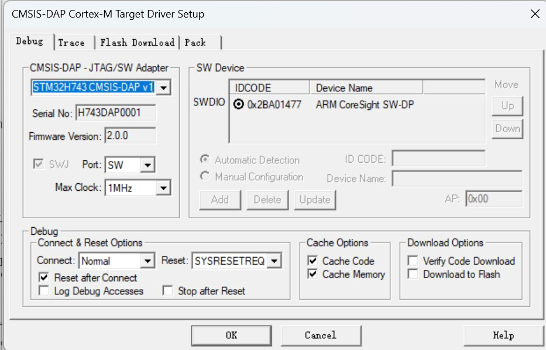

提示词内容：[项目提示词](./007.stm32h743_cmsis_dap/prompter.md)

**AI开发**：项目框架、tinyusb移植、cmsis-dap协议支持 - 60%  
**个人参与**: 仿真环境、提示词、jtag/swd接口处理(找到arm官方例程) - 40%

工作量：

1. tinyusb移植
2. cmsis-dap协议移植支持
3. 整合jtap/swd操作时序，实现完整功能并测试

#### 基于lvgl实现的智能手表应用(nes模拟器、图片查看、文本阅读器)

🚀 [008.基于lvgl实现的智能手表应用(nes模拟器、图片查看、文本阅读器)](./008.stm32h743_lvgl_mos/README.md)

- **时钟**

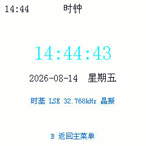

- **相机**

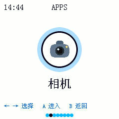

- **文本阅读器**

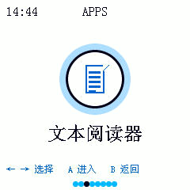

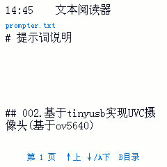

- **nes模拟器**

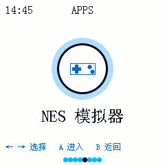

提示词内容：[项目提示词](./008.stm32h743_lvgl_mos/prompter.md)

**AI开发**：项目框架、tinyusb移植、lvgl移植、图像库移植、nes模拟器移植、菜单实现、串口虚拟输入实现 - 95%  
**个人参与**: 仿真环境、提示词、oled驱动、ov5640驱动 - 5%

工作量：

1. ov5640、oled、usb、sd卡底层驱动
2. lvgl ui功能移植
3. nes模拟器功能，上位机虚拟键盘
4. 相机功能，摄像头多缓冲、oled显示
5. 图片查看器，sd卡读取、解析图片
6. 文本查看器，sd卡读取、字库解析，文本显示

#### 基于zephyr实现lvgl功能界面

🚀 [009.基于zephyr实现lvgl界面](./009.stm32h743_zephyr/README.md)

**AI开发**：项目框架、zephyr移植、zephyr兼容lvgl显示、zephyr兼容fatfs功能、ui开发、串口指令支持 - 90%  
**个人参与**: 仿真环境、提示词、oled驱动、功能引导 - 10%

- **lvgl界面**

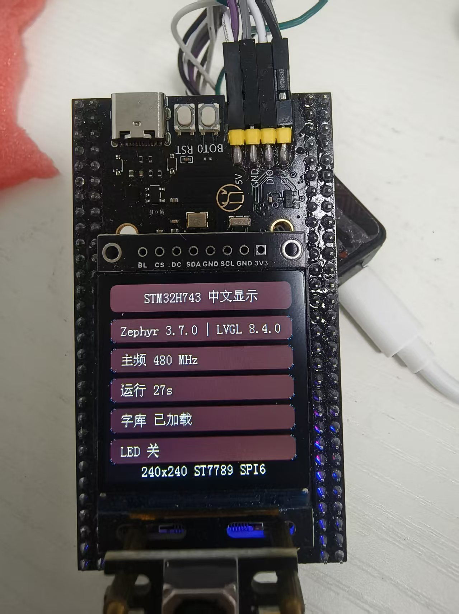

- **zephry命令行**

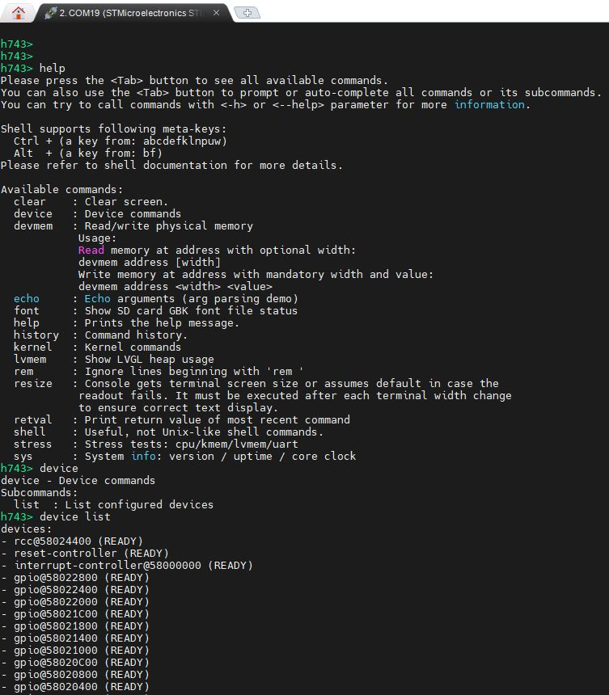

提示词内容：[项目提示词](./009.stm32h743_zephyr/prompter.md)

#### 基于lwip实现局域网管理系统(http/https/uart-shell/telnet-shell/snmp)

🚀 [101.基于lwip实现局域网管理系统(http/https/uart-shell/telnet-shell/snmp)](./101.stm32f429_net/README.md)

**AI开发**：项目框架、网口驱动、FreeRTOS移植、lwip移植、http/https服务、web网页、串口shell命令行、telnet服务、snmp服务、snmp代理服务器、snmp客户端 - 85%  
**个人参与**: 仿真环境、提示词、基础驱动、功能引导 - 15%

- **web访问http**

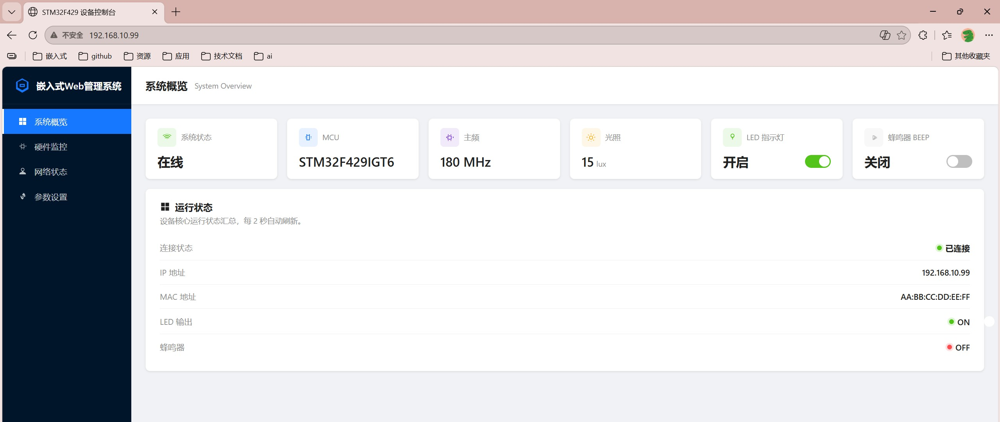

- **web访问https**

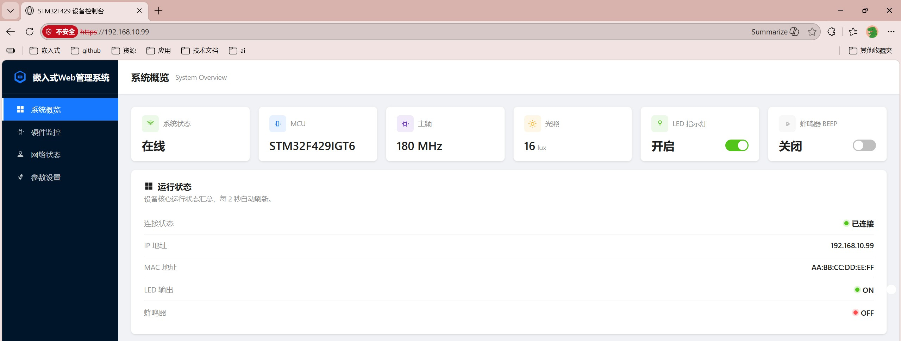

- **串口shell命令行**

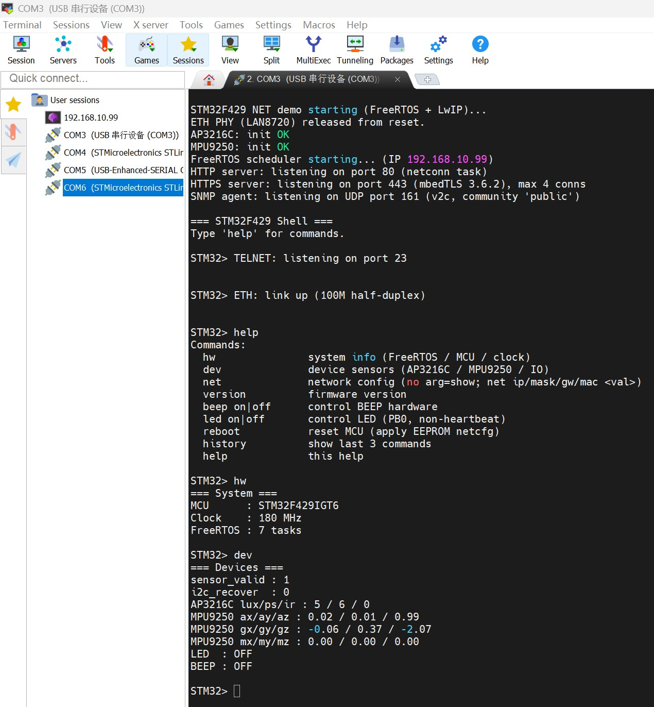

- **telnet接口shell命令行**

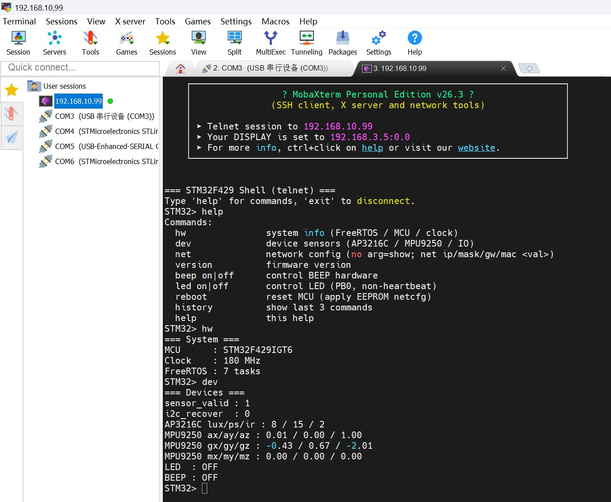

- **snmp代理服务器和客户端**

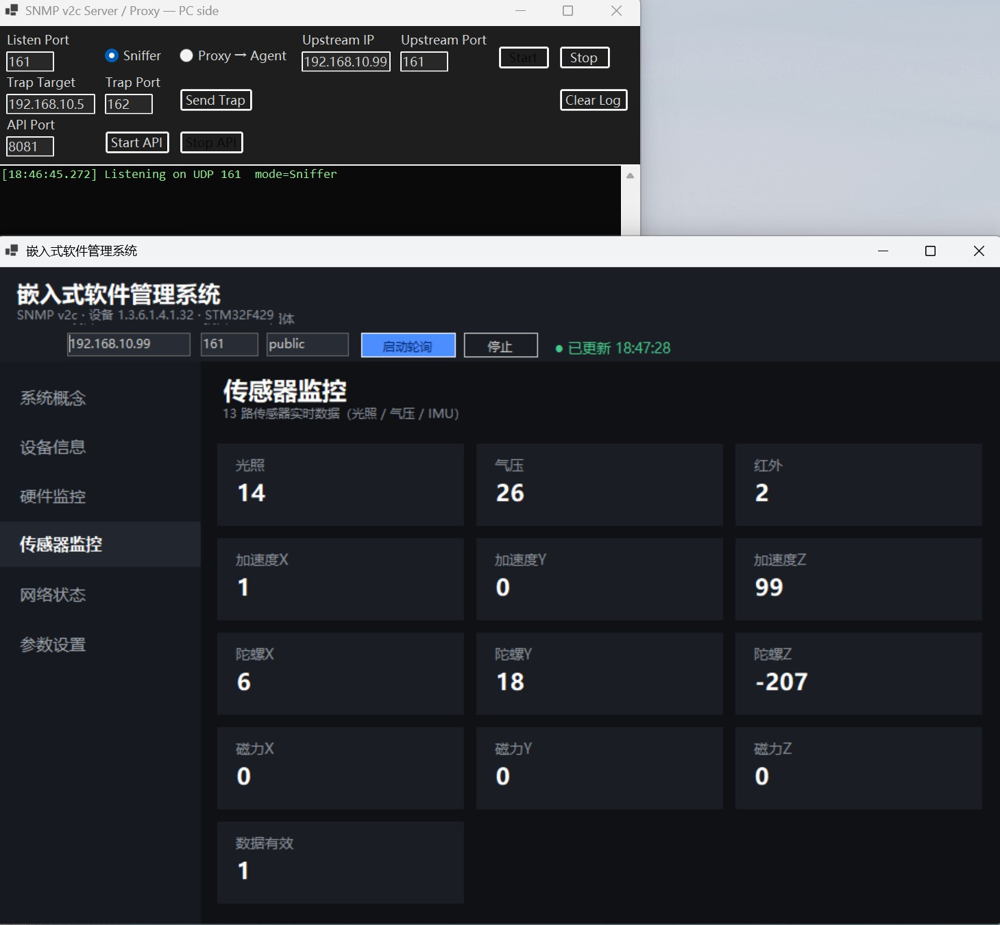

提示词内容：[项目提示词](./009.stm32h743_zephyr/prompter.md)

## 开发经验总结

完成所有这些项目，加上调试整理，并没有花太多的时间。

其中让我印像最深的是人脸检测项目，大概花了3个小时就搞定了，在执行过程中，它还下载了图像库，自己编写python用自己训练了个模型，这颠覆了我对Vibe Coding的认知。

AI的上限是在太高了，这种项目如果让我来做、从可行性、驱动移植编写、模型训练、嵌入式端移植、再整合输出，调试完整，整个需求至少几周时间。

但是于此同时，其实AI的下限也很低，调试CMOS、OLED模块，因为生成的参数配置错误，卡住一个小时也没有解决，有个cmake的文件链接遗漏，导致未链接到正常的中的入口，也是启动卡在循环，花费半小时也没解决。不过这些在提供我已经完善的驱动后，以及手动参与部分修改后，就顺利了实现了项目。

在开发这些项目的时候，总结的经验如下所示。

🏷️ **在提需求时，要对项目有清晰的认知**

包括功能需求、硬件信息、开发步骤和验证手段，不要让AI直接开发一个结果，而是给出建议、步骤和目标，让AI有步骤可行。

🏷️ **已有硬件、驱动资源，可以尽可能的提供**

对于简单的驱动，如rtc、gpio、i2c内部模块完全没有难度；但是对于外部器件(如LCD、CMOS等)，如果直接成功还可以，不成功则重复调试很久都不会成功。调试过的硬件，提供源码比直接生成稳定的多，效率会更高。

🏷️ **提供完整的单片机开发仿真环境**

实现代码才是第一步，无法验证的代码生成后，再去开发调试还要去理解，花费精力并不少，让AI跑通流程是能够迭代的基础。

🏷️ **需要及时的人工干预**

嵌入式需要交叉编译和远程仿真，如果断开或者设备异常，就完全堵塞执行流程，在实现USB项目时，就因为未重新枚举，卡住执行半个小时，这就需要及时的外部干预。

## 使用Vibe Coding感触

Vibe Coding真的颠覆了我的认知，点亮个LED、调试电机、读取传感器，这种实现对于我这种熟练工作并没有吸引力。

不过实现这种我个人能力边界外，知道怎么做，但是苦于没有精力去补足知识点，需要大量时间精力的项目，吸引力就太大了；虽然不想承认，掌握AI开发流程，其能力上限远超过去的我，抗拒只能被淘汰，我也只能努力接受，迭代自身能力，加入到日常的工作流程中。
