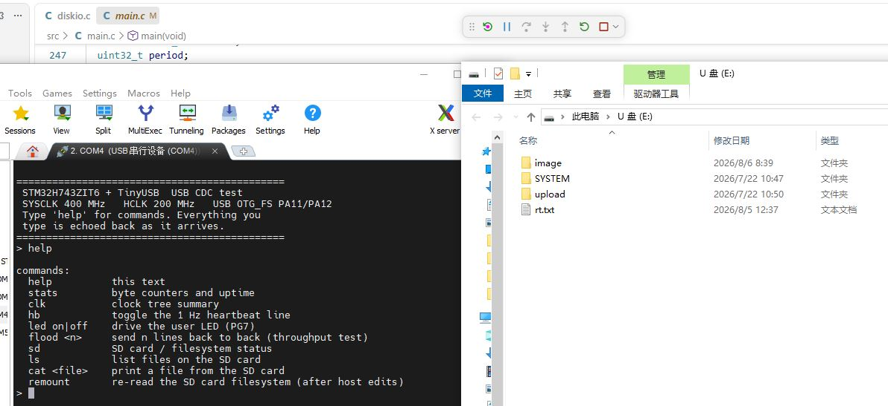
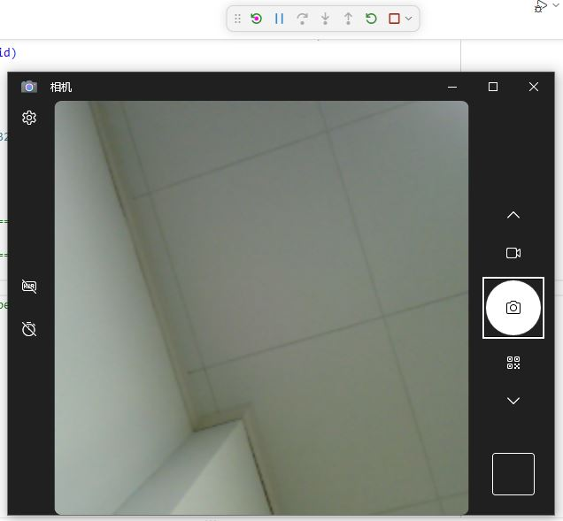
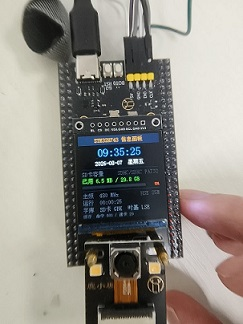
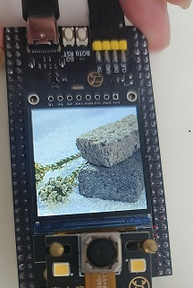
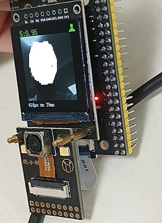
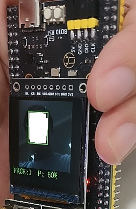

# Mcu_Project_Design_By_Agent

在AI Agent快速发展的当下，前端和桌面端程序已经可以大幅度被AI取代，嵌入式看起来有壁垒，其实作为固定的知识，也已经没有壁垒，使用AI Agent进行单片机开发其实也成为了现实。

对于AI来说，生成代码不困难，不过单片机交叉编译的特性也有其难点，需要解决如下问题。

❓ **如何让AI自动编译、调试、下载和仿真，然后走通loop的自我迭代流程**  
❓ **提示词如何实现，才能让AI更好的规划单片机任务处理**  
❓ **AI完成的项目，如何进行验收应用**  

这里提供我验证过的单片机支持ai agent的环境。

- [单片机支持ai agent开发环境](./document/support.md)  

注意：**项目中使用的Drivers和third_party目录为重复且占用空间较大，因此打包保存为support_tools目录下的**env_support_for_stm32h743.zip**中，解压将内部内容放置在项目中才能进行编译。**

## 项目说明

本系列下项目如下所示。

- 001.基于tinyusb实现USB混合设备(CDC+MSC)
- 002.基于tinyusb实现UVC摄像头(基于ov5640)
- 003.使用lvgl实现oled显示(支持通过sd卡使用中文字库)
- 004.基于SD卡和OLED实现图片轮播功能
- 005.实现基于CMSIS-NN的人存在检测功能(ov5640+CMSIS-NN+人检测)
- 006.实现基于CMSIS-NN的人脸检测和显示的功能(ov5640+CMSIS-NN+人脸模型)

### 具体项目效果和提示词说明

🚀 [001.基于tinyusb实现USB混合设备(CDC+MSC)](./001.stm32h743_tinyusb_cdc_msc/README.md)

提示词内容：[项目生成时提示词](./001.stm32h743_tinyusb_cdc_msc/prompter.md)

🚀 [002.基于tinyusb实现UVC摄像头(基于ov5640)](./002.stm32h743_tinyusb_uvc_ov5640/README.md)

提示词内容：[项目生成时提示词](./002.stm32h743_tinyusb_uvc_ov5640/prompter.md)

🚀 [003.使用lvgl实现oled显示(支持通过sd卡使用中文字库)](./003.stm32h743_lvgl_oled/README.md)

提示词内容：[项目生成时提示词](./003.stm32h743_lvgl_oled/prompter.md)

🚀 [004.基于SD卡和OLED实现图片轮播功能](./004.stm32h743_sd_oled_img/README.md)

提示词内容：[项目生成时提示词](./004.stm32h743_sd_oled_img/prompter.md)

🚀 [005.实现基于CMSIS-NN的人存在检测功能(ov5640+CMSIS-NN+人检测)](./005.stm32h743_person_detect/README.md)

提示词内容：[项目生成时提示词](./005.stm32h743_person_detect/prompter.md)

🚀 [006.实现基于CMSIS-NN的人脸检测和显示的功能(ov5640+CMSIS-NN+人脸模型)](./006.stm32h743_face_detect/README.md)

提示词内容：[项目生成时提示词](./006.stm32h743_face_detect/prompter.md)
